# W1 Intro to AI
## 1.1 What is AI?

The science of making machines that: Think rationally, Think like people, Act like people, Act rationally(optimally)

Better called Computational Rationality - Maximize Your Expected Utility

## 1.2 What about Brain?
Lessons learned: memory(data) and simulation(computation) are key to decision making

Brains are to intelligence as wings are to flight

## 1.3 Course Topics
- __Intelligence from Computation__:  
About algorithms that through computation, take a situation and figure out something smart to do

- __Intelligence form Data__:  
ML

- __Throughout Applications__:  
NLP, Games

## 1.4 Design Rational Agent
An agent is an entity that perceives and acts.  
A rational agent selects actions that maximize its (expected) utility.  
Characteristics of the percepts, environment, and action space dictate techniques for selecting rational actions


# W2 Searches


## 2.1 Uninformed Searches
### 2.1.1 Agents that plan
#### 2.1.1.1 Reflex Agents

- choose action based on current percept(and maybe memory)
- May have memory or a model of the world's current state
- Do not consider the future consequences of their actions
- Consider how the world ***IS***
(could be rational)

#### 2.1.1.2 Plaaning Agents

- Ask "what if"
- Decision based on (hypothesized) consequences of actions
- Must have a model of how the world evolves in response to actions
- Must formulate a goal(test)
- Consider how the world ***WOULD BE***

### 2.1.2 Search Problems

A ***Search Problem*** consists of:  
- A state space
- A successor function (with actions, costs)
- A start state amd a goal test

A ***solution*** is a sequence of actions which transforms the start state to a goal state

***World State*** includes every last detail of the environment.  

***Search State*** keeps only the details needed for planning.

***State Space Graphs***  
Nodes are abstracted world configurations;  
Arcs represent successors(action results);  
The goal test is a set of goal nodes (maybe only one);
Each state occurs only once;  

#### 2.1.2.1 DFS v.s. BFS

***Iterative Deepening***:   
Run DFS with deep limit 1: if not ...  
Run DFS with deep limit 2: if not ...  
...  

#### 2.1.2.2 Uniform Search v.s. Dijkstra
单源至单点（贪心找路径，找到一条之后继续找比当前cost小的路径搜索直到都比当前solution大） 单源至所有  
都是Complete且Optimal

## 2.2 A* Search and Heuristics
### 2.2.1 Heuristics

A heuristic is is a function that estimates how close state is to a goal. Designed for a particular search problem


### 2.2.2 A* Search

we only stop when dequeue a goal, not enqueue a goal

A* is not optimal(because heuristic is not always correct? (inadmissible, pessimistic))

***Admissibility***:
h is admissible if 0 <= h(n) <= h*(n), where h*(n) is the true cost to a nearest goal. e.g. Manhattan Distance

***Dominance***: ha >= hc if for any n, ha(n) >= hc(n)
Max ofd admissible heuristics is admissible: h(n) = max(ha(n), hb(n))

#### 2.2.3 Graph Search

Idea: Never expand a state twice
- Tree search + "closed set"
- Expand the search tree node-by-node, but...
- Before expanding a node, check to make sure its state has never been expanded before
- If not new, skip it, if new add to closed set

***Consistency***: h(A) - h(C) <= cost(A to C)
If hh is consistent, then A* graph search finds an optimal solution.


# W3 Constraint Satisfaction Problems（约束满足问题）

## 3.1 CSP 1

"What is search for?"
- Assumptions about a world: a single agent, deterministic actions, fully observed state, discrete state space. Deterministic  
- Planning: sequences of actions
    - The path to the goal is the important thing
    - Paths have various costs, depths
    - Heuristics give problem-specific guidance
- Identification: assignments to variables
    - The goal it self is important, not the path
    - All paths at the same depth (for some formulations)
    - CSPs are a specialized class of identification problems
(Planning像是小偷确定如何偷东西的步骤，Identification像是侦探根据线索倒推如何失窃的过程)


### 3.1.1 Difference between Standard Search Problems

- Standard Search Problems:
    - State is a "black" box: arbitary data structure (can only call GetSuccessor(), isGoal())
    - Goal test can be any function over states
    - Successor functgion can also be anything

- CSP(e.g., Color Mapping, N-Queens, Sudoku)
    - A special subset of search proiblems
    - State is defined by variables Xi with values from a domain D (sometimes D depends on i)
    - Goal test is a set of constraints specifying allowable combinations of values for subsets of variables

### 3.1.2 Standard Search Formulations
States defined by the values assigned so far (partial assignments)
- Initial state: {}
- Successor function: assign a value to an unassigned variable
- Goal test: the current assignment is complete and satisfies all constraints

#### 3.1.2.1 Search Methods
For example, color mapping problem.
DFS. Naive way. Better idea?
Backtracking Search.

#### 3.1.2.2 Backtracking Search
- One variable at a time
    - variable assignments are commutative, so fix ordering. i.e., [WA = red then NT = green] same as [NT = green then WA = red]
    - only need to consider assignments to a single variable at each step
- Check constraints as you go

Backtracking = DFS + variable-ordering + fail-on-violation

#### 3.1.2.3 Filtering
***Filtering***: Keep track of domains for unassigned variables and cross off bad options.
***Forward Checking***: Cross off values that violates a constraint when added to the existing assignment

***Constraint Propagation***: Reason from constraint to constraint

### 3.1.3 Arc Consistency
An arc X->Y is consistent iff for every x in the tail there is some y in the head which could be assigned without violating a constraint

***Forward Checking***: Enforcing consistency of arcs pointing to each new assignment

### 3.1.4 Ordering
Variable Ordering: Minimum remaiuning values(MRV)
Choose the variable with the fewest legal left values in its domain

## 3.2 CSP 2
NP-Hard 

Arc consistency detects failure earlier than forward checking 

filter - assign - fileter - assign ...

### 3.2.1 K-Consistency

"Instead of checking all arcs are following the rule, check all triples or quads"

1-Consistency (Node Consistency): Every node domain has a value which meets that nodes's unary constraints

2-Consistency (Arc Consistency): For each pair of nodes, any consistent assignment to one can be extended to the other

K-Consistency: For each k nodes, any consistent assignment to k-1 ca be extended to the kth node.

Strong n-consistency means we can solve without backtracking

### 3.2.2 Tree-Structured CSPs

(Only need Arc-consistency)

If the constraint graph has no loops, the CSP can be solved in O(nd^2), compare to General CSPs where worst-case time is O(d^n)


### 3.2.3 Iterative Algorithms for CSPs

### 3.2.4 Simulated Annealing

"Solve" the hill climbing problem by allowing some "downhill" moves


# W4 Game Trees

"solved": You know you can force a win or draw if both sides play optimally
## 4.1 Minimax (Adversarial Search)

### 4.1.1 Types of Games

- Deterministic or stochastic?
- One, two or more players?
- Zero sum?
- Perfet information (can you see the state)?

### 4.1.2 Zero-sum Game

- Agents have opposite utilities (value on outcome)
- Let us think of a single value that one maximizes and the other minimizes
- Adversarial, pure competition

### 4.1.3 Adversarial Search

You do -> Adversary do against you -> You do ...

- A state-space search tree
- Players alternate turns
- Compute each node's minimax value: the best achievable utility against a rational(optimal) adversary

```
def value(state):
    if the state is a terminal state: return the state's utility
    if the next angent is MAX: return max-value(state)
    if the next agent is MIN: return min-value(state)

def max-value(state):
    intitialize = - ∞
    for each successor of state:
        v = max(v, value(successor))
    return v

def min-value(state):
    intitialize = - ∞
    for each successor of state:
        v = min(v, value(successor))
    return v
```

***Time Complexity:*** O(b^m)  
***Space Complexity:*** O(bm)


### 4.1.4 Alpha-Beta Pruning

With “perfect ordering”:  
- Time complexity drops to O(bm/2)
- Doubles solvable depth!
- Full search of, e.g. chess, is still hopeless
- This is a simple example of metareasoning 

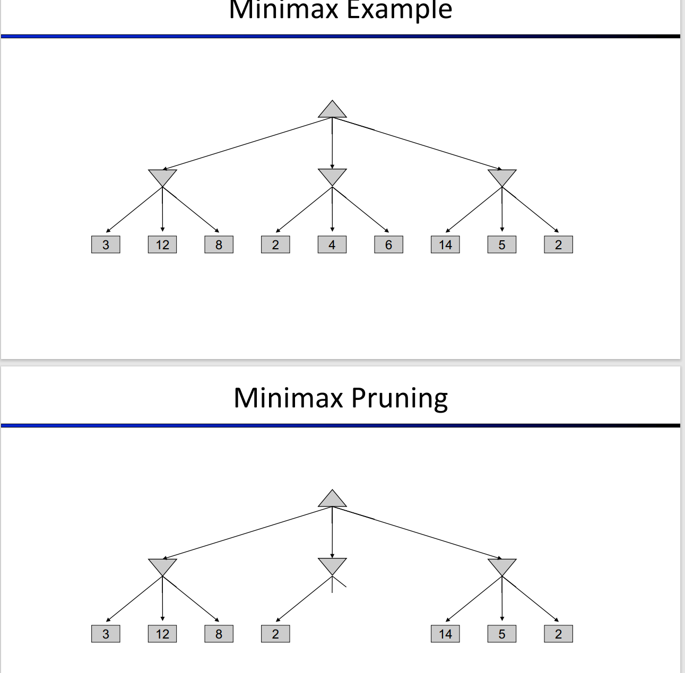

Evaluation functions are always imperfect.  
The deeper in the tree the evaluation function is buried, the less the quality of the evaluation function matters. 

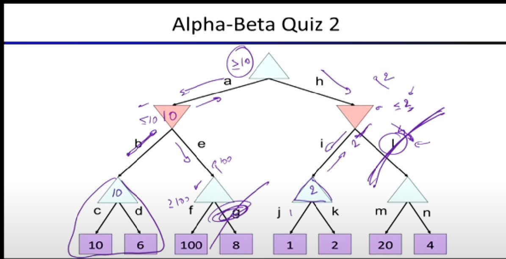

## 4.2 Expectimax, Uncertainty and Utilities

### 4.2.1 Expectimax Search

Expectimax search: compute the average score under optimal play

- Max nodes as in minimax search
- Chance nodes are like min nodes but the outcome is uncertain
- Calculate their expected utilities
- I.e. take weighted average (expectation) of children


***Dangerous Optimism*** Assuming chance when the world is adversarial

***Dangerous Pessimism*** Assuming the worst case when it’s not likely

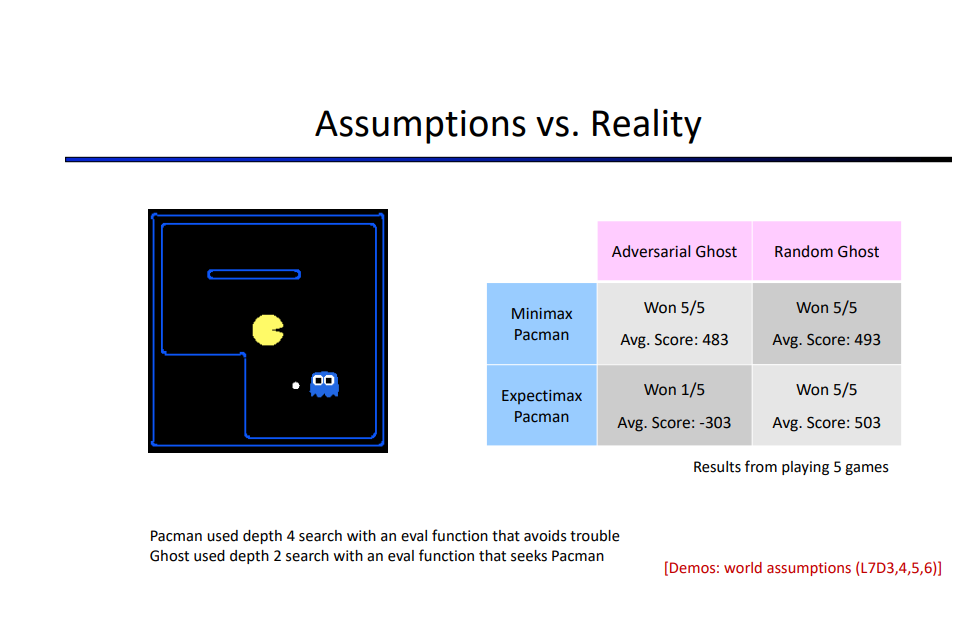

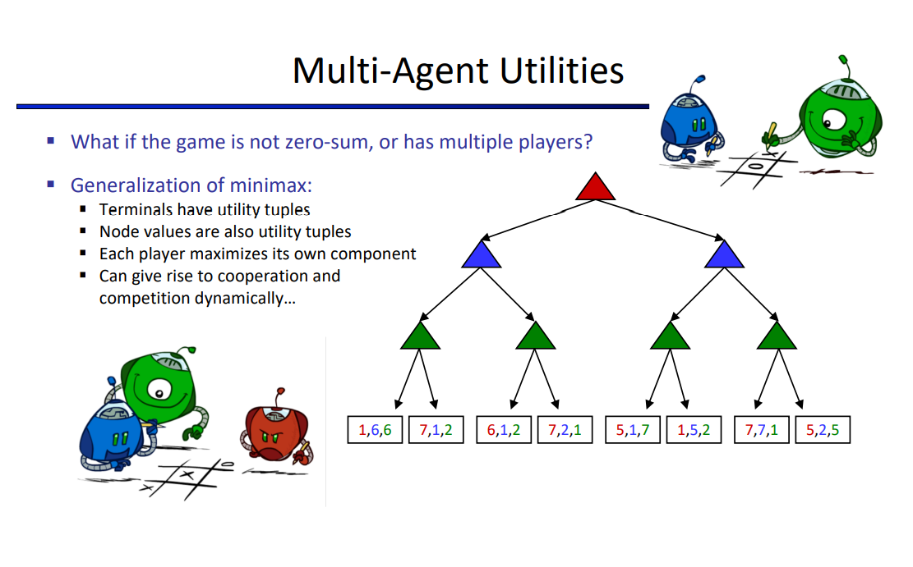

### 4.2.2 Uncertainty 

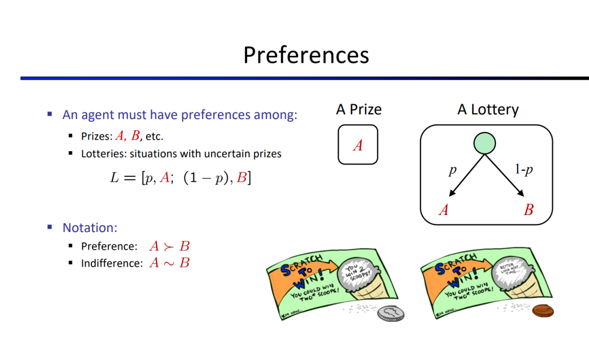

# W5 Markov Decision Process
(https://blog.csdn.net/liubai01/article/details/84441464#t7)
## 5.1 MDPs I

### 5.1.1 Non-Deterministic Search 不确定搜索 
想象一个跑者，即将到达他人生中第一趟马拉松的终点。虽然看起来他将完成比赛并为这事吹一年，但是依然没人能保证这一点。他可能累到晕倒，或者脚滑摔倒自断双腿。再夸张一点，可能一不小心就发生了一场惊天动地的大地震，在他还差几米就跨过终点时把他给埋了。这些可能给跑者的行为增加了一些不确定性(uncertainty)，这种不确定性就是接下来要讨论的对象。在第一章笔记中，我们讨论了传统搜索问题及其解法；然后，在第三章笔记中，我们改变了模型，将那些对我们到达目标的路径造成影响的对手和其他agent也纳入考虑。现在，我们将再次改变模型来考虑另一个影响因素——世界本身的动态变化。Agent所在的环境会迫使agent的行为变得不确定(nondeterministic)，意味着在某一状态下采取的一个行动会有多个可能的后继状态。实际上，这就是许多像扑克牌或是黑杰克这样的卡牌游戏中会出现的情况，存在着由发牌的随机性导致的固有的不确定性。这种在世界中存在一定程度的不确定性的问题被称为不确定搜索问题(nondeterministic search problems)，可以用马尔科夫决策过程(Markov decision processes)或者称为MDPs来解决。

### 5.1.2 Markov Decision Process

马尔可夫决策过程包含了几个属性：

- 一个状态集S。MDP中的状态的表示方法与传统搜索问题中的相同。
- 一个操作集A。MDP中的操作的表示方法也与传统搜索问题中一致。
- 一个起始状态。
- 可能存在一个或多个最终状态。
- 可能会有一个折扣因子(discount factor)y。我们后面会讲到这个。
- 一个转换函数(transition function) T(s, a, s')。我们已经介绍过了不确定操作的概率，我们需要一个方法来描述从任意状态执行任意行动后得到的各种输出的可能性。MDP的转换函数就是干这事的——这是一个概率函数，用来表示一个agent从状态s∈S采取行动a∈A后得到状态s'∈S的概率。
- 一个奖励函数(reward function) R(s, a, s')。通常，MDP每一步对agent的存活的“活着”奖励都比较小，而对到达最终状态的奖励则十分丰厚。奖励有可能是正数或负数，取决于他们在问题中是否对agent有利，而agent的目标通常都是在达到某一最终状态之前获得尽可能多的奖励。


用expecti-max算法求解，问题：太浪费，重复太多子树

### 5.1.3 Value Iteration
现在我们有了一个能验证MDP中各状态的值的最优性的框架，接下来自然就想知道如何能精确计算出这些最优值。为此我们需要限时值（time-limited values）（强化有限界得到的结果）。限制时间步数为k的一个状态s的限时值表示为 Vk(s)，代表着在已知当前MDP会在k时间步后终止的情况下，从s出发能得到的最大期望效益。这也正是一个在MDP的搜索树上执行的k层expectimax所返回的东西。

值迭代(Value iteration)是一种动态规划算法(dynamic programming algorithm)，通过一个迭代加长的时间限制来计算限时值，直到收敛（也就是说，直到每个状态的V值都与其之前的迭代一样）

## 5.2 MDPs II
- 值迭代Value iteration：迭代更新直至收敛，用于计算状态的最优值。
- 策略评估 Policy evaluation：用于在一个特定的策略下计算状态的值。
- 策略提取 Policy extraction：用于在给定一些状态值函数的情况下决定一个策略。如果状态值是最优的，这个策略也就是最优的。这一方法在进行值迭代之后使用，用于从最优状态值计算得到最优状态；或是在值迭代中作为一个子程序，用于计算当前估计状态值的最佳策略。
- 策略迭代 Value iteration：一种将策略评估和策略提取集于一身的技术，用于迭代收敛从而得到一个最优策略。其表现优于值迭代，这是由于策略往往比状态值收敛得快得多。

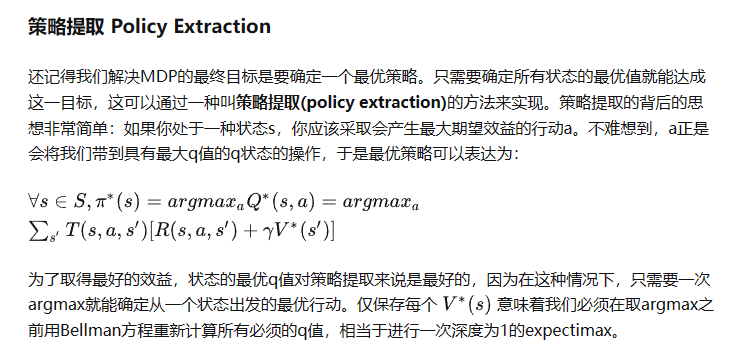
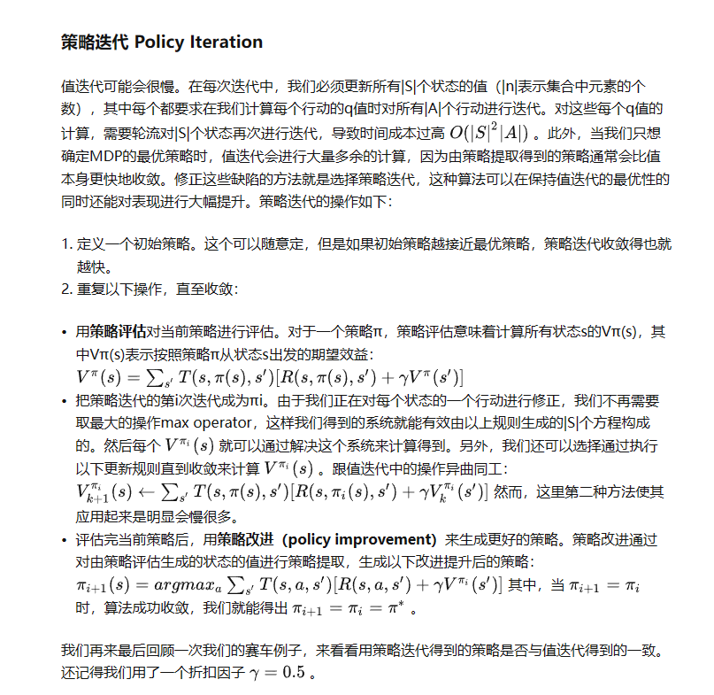

# W6 Reinforcement Learning

## 6.1 RL I

### 6.1.1 Model-based

Step1: Learn emprical MDP model

- Count outcomes s' for each s, a
- Normalize to give an estimate of T(s, a, s')
- Discover each R(s, a, s') when we experience (s, a, s')

Step2: Solve the learned MDP
- Use methods mentioned before (value iteration)


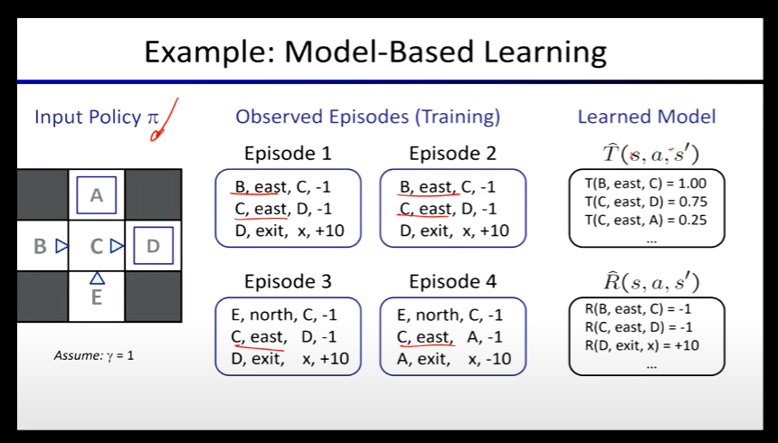


### 6.1.2 Model-free
Intuition: 不去还原MDP的transition model和reward方程，只是对用于做决策值进行估计。例如（Q值和V值）
#### 6.1.2.1 Passive
Simplified task: policy evaluation (w.r.t: a fixed policy) with unknown T and R.

Direct v.s. Indirect Evaluation

##### 6.1.2.1.1 Direct evaluation(Passive)
- Goal: Compute values for each state under π

- Idea: Average together observed sample values

    - Act according to π
    - Every time you visit a state, write down what the sum of discounted rewards turned to be(remark: may complete when reviewing the process, since knowing sum of discounted rewards means you need to know the future with respect to the current state)
    - Average those samples
- Pros: It is easy to understand. It doesn't require any knowledge of T, R. It eventually computes the correct average values, using just sample transitions.

- Cons: It wastes information about state connections. Each state must be learned separately. So, it takes a long time to learn.

##### 6.1.2.1.2 Temporal Difference Learning(Passive)
Intuition: base on fixed policy, evaluate V(s) value each time we experience a transistion (s, a, s', r).

Formula:
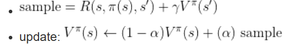

Remark: to be temporally invariant, decrease alpha after trainning a long time.

Limitation: V value is hard to be updated a new policy. (TODO: learn Q-value instead of V, model-free!)

##### 6.1.2.1.3 Q-Learning(Passive)
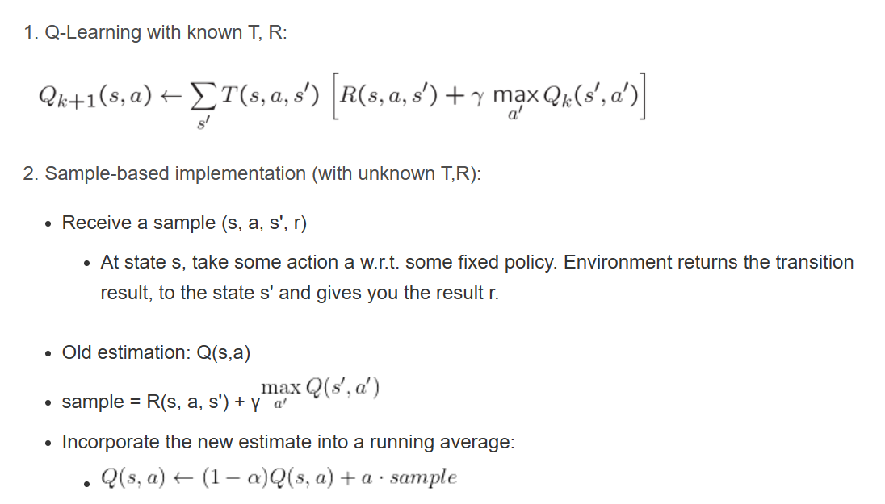

#### 6.1.2.2 Active
Goal: Learn optimal policy/values with unknown T and R.

Trade-off: exploration vs. exploitation

Common terms in RL context:

1. Exploration: you have to try unknown actions to get information
2. Exploitation: eventually, you have to use what you know
3. Regret: even if you learn intelligently, you make mistakes
4. Sampling: because of chance, you have to try things repeatedly
5. Difficulty: learning can be much harder than solving a known MDP

##### 6.1.2.2.1 Q-Learning(Active)
Learner makes choices with variant policy (according to current values/policy, and also explore).

Amazing result: Q-Learning converges to optimal policy -- even if you're acting suboptimally!

### 6.1.3 Summary

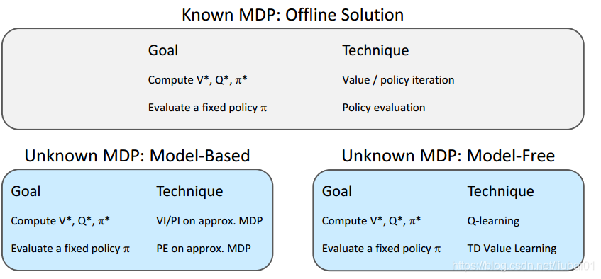

## 6.2 RL II

### 6.2.1 Learning Policy

#### 6.2.1.1  ε greedy

With (small) probability ε, act randomly

With(large) probaility ε, act on current policy 

#### 6.2.1.2 Exploration functions

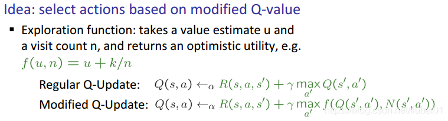

#### 6.2.1.3 Generalizing Across States 

#### 6.2.1.4 Feature-based Representations 

Linear Value Function
Q(s, a) = w1f1(s, a) + w2f2(s, a) + ... + wnfn(s, a)

# W7 Probability and Bayes' Nets 1

## 7.1 Probability

## 7.2 BNs: Representation

### 7.2.1 Probalistic Model

- Explaination (diagnostic reasoning)
- Prediction (casual reasoning)
- Value of information

### 7.2.2 BN Semantics

- A set of nods, one per variable x
- A directed acyclic graph
- A conditional distribution for each node


## W8 Bayes' Nets 2

### 8.1 BNs: Independence


## W9 Bayes' Nets 3

### 9.1 BNs: Inference
Calculating some useful quantity from a joint probability distribution

#### 9.1.1 Inference by Enumeration 

Join Factors -> Eliminate

#### 9.1.2 Variable Elimination

Marginalizing early

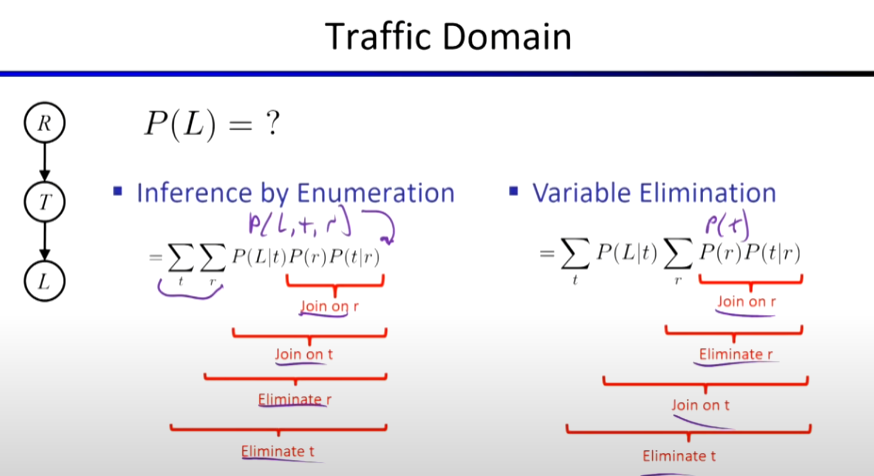

- Inerleave joining and marginalizing

- d^k entries computed for a factor over k variables with domain sizes d

- Ordering of elimination of hidden variables can effect size of factors generated

- Worst case: running time exponential in the size of the bayes' net

### 9.2 BNs: Sampling

- Prior Sampling
- Rejection Sampling
- Likelihood Sampling
- Gibbs Sampling

## W10 Decision Networks / VPI / Hidden Markov Models

### 10.1 Decision Networks and Value of Information

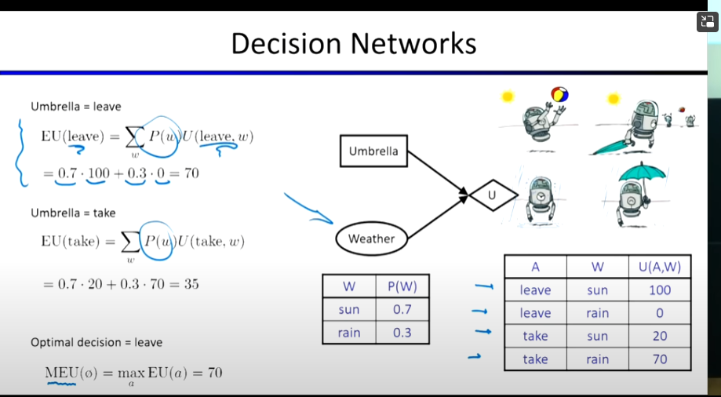

### 10.2 HMMs

https://blog.csdn.net/liubai01/article/details/84206592

## W11 Particle Filtering / Apps of HMMs / Naive Bayes

### 11.1 HMMs, Particle Filters, and Applications

### 11.2 ML: NB

## W12 ML: Artificial Neural Networks

### 12.1 ML: Perceptrons and Logistic Regression


### 12.2 ML: Optimization and Neural Networks

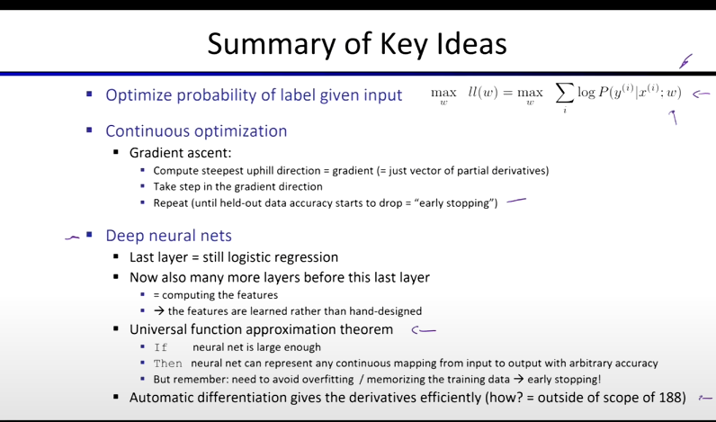
## W13 ML: Neural Networks II and Decision Trees

### 13.1 ML: Neural Networks II and Decision Trees


## W15 Advanced Topics

### 15.1 Robotics / Language / Vision

### 15.2 Advanced Topics