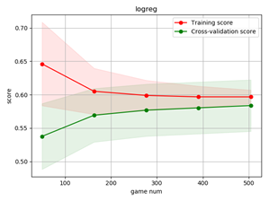
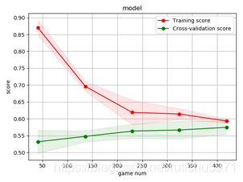
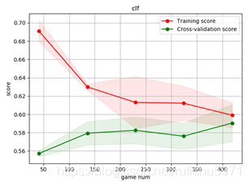
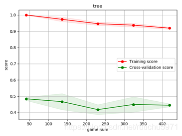
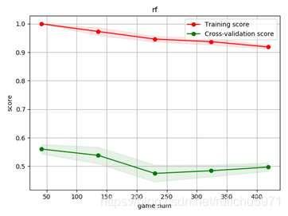

# 误差原因分析

### 尝试方法1 分别输出以上机器学习算法的学习曲线

```python
# 学习曲线函数

def plot_learning_curve(estimator, title, X, y, ylim=None, cv=None,
                        n_jobs=1, train_sizes=np.linspace(.1, 1.0, 5)):
    plt.figure()
    plt.title(title)
    if ylim is not None:
        plt.ylim(*ylim)
    plt.xlabel("game num")
    plt.ylabel("score")
    train_sizes, train_scores, test_scores = learning_curve(
        estimator, X, y, cv=cv, n_jobs=n_jobs, train_sizes=train_sizes)
    train_scores_mean = np.mean(train_scores, axis=1)
    train_scores_std = np.std(train_scores, axis=1)
    test_scores_mean = np.mean(test_scores, axis=1)
    test_scores_std = np.std(test_scores, axis=1)
    plt.grid()

    plt.fill_between(train_sizes, train_scores_mean - train_scores_std,
                     train_scores_mean + train_scores_std, alpha=0.1,
                     color="r")
    plt.fill_between(train_sizes, test_scores_mean - test_scores_std,
                     test_scores_mean + test_scores_std, alpha=0.1, color="g")
    plt.plot(train_sizes, train_scores_mean, 'o-', color="r",
             label="Training score")
    plt.plot(train_sizes, test_scores_mean, 'o-', color="g",
             label="Cross-validation score")

    plt.legend(loc="best")
    return plt

cv = ShuffleSplit(n_splits=line, test_size=0.2, random_state=0)
plot_learning_curve(logreg, "logreg", tr_x, tr_y, ylim=None, cv=cv, n_jobs=1)
plot_learning_curve(tree, "tree", tr_x, tr_y, ylim=None, cv=None, n_jobs=1)
plot_learning_curve(rf, "rf", tr_x, tr_y, ylim=None, cv=None, n_jobs=1)
plot_learning_curve(model, "model", tr_x, tr_y, ylim=None, cv=None, n_jobs=1)
plot_learning_curve(clf, "clf", tr_x, tr_y, ylim=None, cv=None, n_jobs=1)

```

逻辑回归学习曲线


神经网络学习曲线


支持向量机学习曲线：


结果图上可以看出，随着数据量的增加，三组模型虽然趋近于收敛，但是在训练集和检验集上准确度表现都很差，仅有0.58左右。这预示着存在着很高的偏差，是欠拟合的表现。

决策树学习曲线


随机森林学习曲线


决策树和随机森林出现了高方差情形，也就是过拟合的情况。这都预示着我们要找到正确率低原因，并且优化我们的模型。

### 尝试方法2 输出灰色关联矩阵

```python
def GRA_ONE(DataFrame,m=-1):
    gray= DataFrame
    # 读取为df格式
    gray=(gray - gray.min()) / (gray.max() - gray.min())
    # 标准化
    std = gray.iloc[:, m]  # 为标准要素
    ce = gray.iloc[:, 0:]  # 为比较要素
    n=ce.shape[0]
    m=ce.shape[1]# 计算行列

    # 与标准要素比较，相减
    a=zeros([m,n])
    for i in range(m):
        for j in range(n):
            a[i,j]=abs(ce.iloc[j,i]-std[j])

    # 取出矩阵中最大值与最小值
    c=amax(a)
    d=amin(a)

    # 计算值
    result=zeros([m,n])
    for i in range(m):
        for j in range(n):
            result[i,j]=(d+0.5*c)/(a[i,j]+0.5*c)

    # 求均值，得到灰色关联值
    result2=zeros(m)
    for i in range(m):
            result2[i]=mean(result[i,:])
    RT=pd.DataFrame(result2)
    return RT

def GRA(DataFrame):
    list_columns = [str(s) for s in range(len(DataFrame.columns)) if s not in [None]]
    df_local = pd.DataFrame(columns=['home_times','away_times','home_win','away_win','home_goals','away_goals','home_r_win','away_r_win','home_Ave_goal','away_Ave_goal'])
    for i in range(len(DataFrame.columns)):
        df_local.iloc[:,i] = GRA_ONE(DataFrame,m=i)[0]
    return df_local
play_score = GRA(team_merge.drop(columns=['result']))

```

统计出每个特征关联度的均值后，我们发现大部分的特征关联度都在0.738021~0.710410之间，也就是说大部分特征都与结果呈现出了相对较高的关联性。
这也意味着已有的数据源的特征关联度对之前模型的影响是有限的。

### 尝试3 重新分析测试集与预测结果
发现在预测平局方面，算法预测结果有着较大的误差。于是我们推测由于结果集中的平局拉低了模型的准确度。

我们重新检查数据源，发现平局的情况仅有199条，而仅凭借着这些较少数据量去很好的训练数据是不合适的。 于是我们开始探讨简化结果集即去掉平局结果的可行性。

在充分了解世界杯的规则后，从16强开始，就意味着告别了小组赛，开始了淘汰赛。如遇到平局，就开始加时赛以及点球大战。即比赛结果只有胜负两种结果。而数据集中的比赛结果是将点球大战排除在外的90分钟内的比赛结果。 所以含有平局的情况。

# 模型改良

将play_score_normal.csv中所有的结果集为-1（即平局的数据去掉）
重新采用上述机器学习算法进行训练学习。

训练结果如下：
神经网络:
训练集准确度:0.570
测试集准确度:0.570
平均绝对误差: 0.5740740740740741

逻辑回归:
训练集准确度:0.554
测试集准确度:0.622
平均绝对误差: 0.5296296296296297

决策树:
训练集准确度:0.894
测试集准确度:0.407
平均绝对误差: 0.8074074074074075

随机森林:
训练集准确度:0.894
测试集准确度:0.485
平均绝对误差: 0.7111111111111111

SVM支持向量机:
训练集准确度:0.592
测试集准确度:0.530
平均绝对误差: 0.6222222222222222

由上可见，准确度有了略微的提升，但这还不是我们想要达到的准确度。 于是我们继续研究，并尝试使用深度学习算法继续提升模型的准确度

于是我们使用了Sequential模型，它是多个网络层的线性堆叠，通过堆叠许多层，构建出深度神经网络。

```python
model_k = Sequential()
model_k.add(Dense(output_dim=500, input_dim=10, activation='relu'))
model_k.add(Dense(output_dim=500, input_dim=200, activation='relu'))
model_k.add(Dense(units=2, activation='softmax'))

# 为了保证数据一致性，将目标类转化为独热编码，同时我们想要计算交叉熵损失函数，Adam算法作为优化算法，然后把准确率当做衡量这个算法的指标

y = to_categorical(tr_y, 2)
model_k.compile(loss='categorical_crossentropy',
                optimizer='adam', metrics=['accuracy'])

# 以200个样本为一批进行迭代

model_k.fit(np.asarray(tr_x), y, epochs=200, batch_size=200)
result = model_k.evaluate(np.asarray(tr_x), y)
y_pred = model_k.predict_classes(np.asarray(te_x))
print(result[1])
```

正确率已经能够到达92%。但需要进一步的调参，找到更合适的参数，防止过拟合。
接下来我们暂时用此模型，对世界杯的结果进行模拟预测。

注意：
数据量较少。
近几年球队的数据更能反映出该球队的状态。
未来可以考虑每个队员对于球队的重要性以及影响，从而将阵容名单及伤病纳入考虑。
ELO Rating, xG预测。
