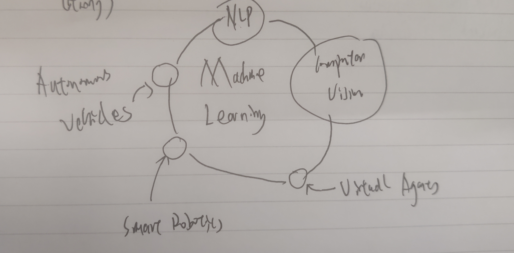

# Value of AI for Enterprise

"Intelligence" can be described as involving mental activities, such as learning, reasoning, and understanding (Lichtenthaler, 2019)

- Understanding
- Reasoning
- Learning
- Integrating

## Narrow AI (Weak AI)

Focused on addressing very focused tasks based on "Common Knowledge". e.g., buying a book with a voice based device

## Broad AI (AI for enterprise)

Integrating AI within a specific industry knowledge and data to train this type of system. e.g., self-driving cars are a collection of narrow AI systems that can make decisions

## General AI (Strong AI)

# AI Enterprose Application 

Sensors -> Data -> Analytics -> Information(Understand) -> Cognitive(Reason) -> Knowledge(Learn)

AI

- A science and a set of computational technologies that are inspired by - but typically operate quite differently from the ways people use their nervous systems and bodies to sense, learn, reason and take action.

- Classify machines that mimic human intelligence. Used to predict, automate and optimize tasks that humans historically done

# Chatbot

(backend) intents, entities, dialog

# Machine Learning

Supervised, Unsupervised (Recommendations), Reinforcement

1. Gathering data
2. Data Prparation
    - Training / Evaluation
    - Classification
    - Unordered
3. Choosing a model
4. Training
5. Evaluation
6. Parameter Tuning
7. Prediction