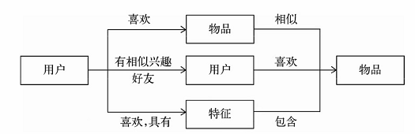
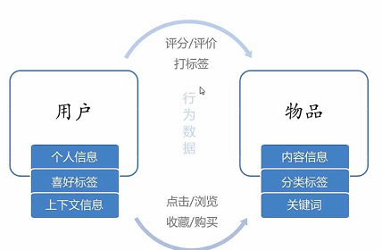
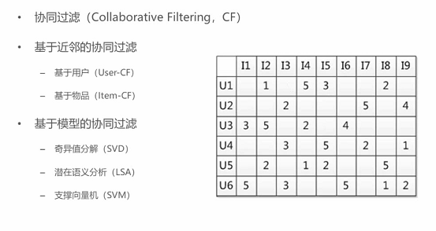
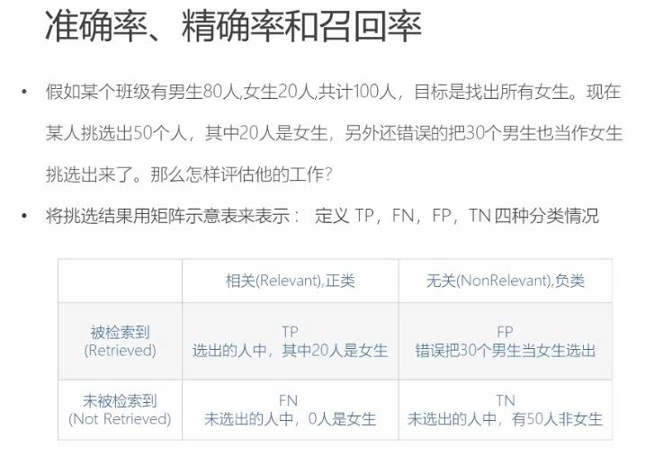
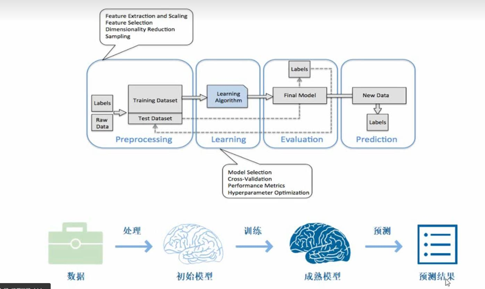
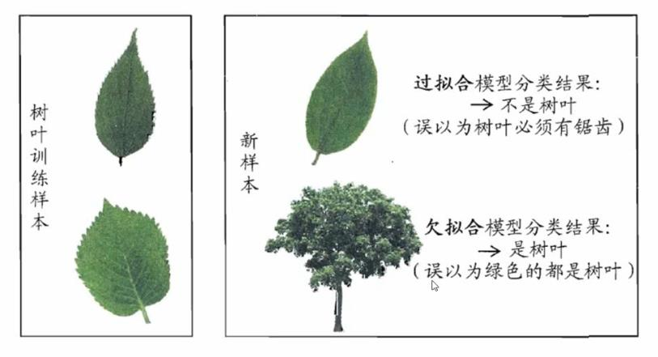
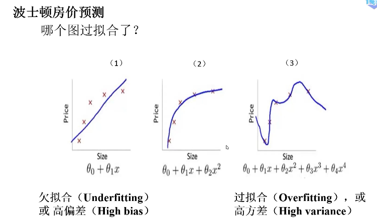
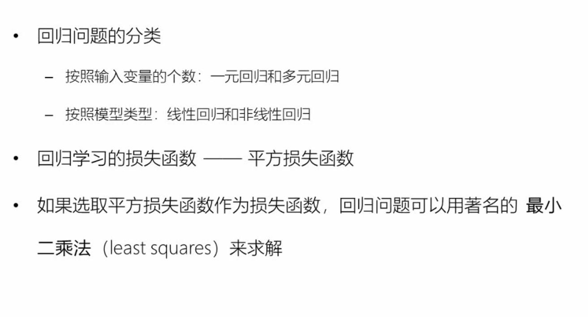
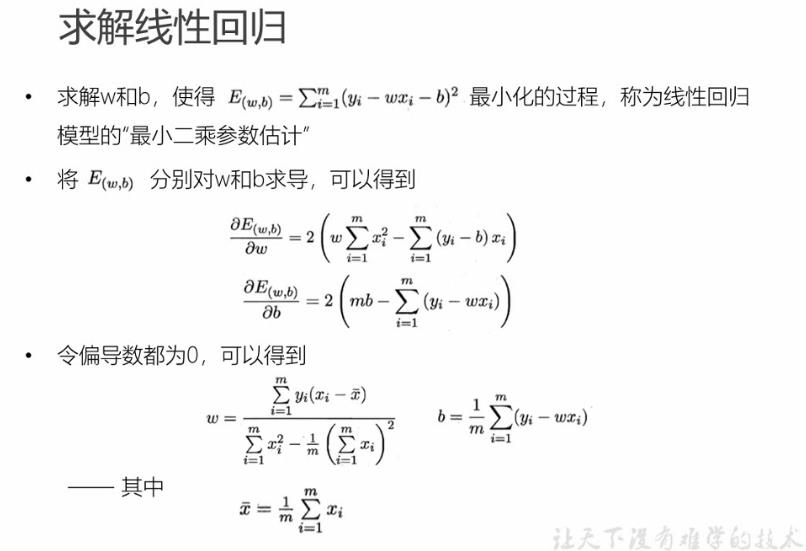
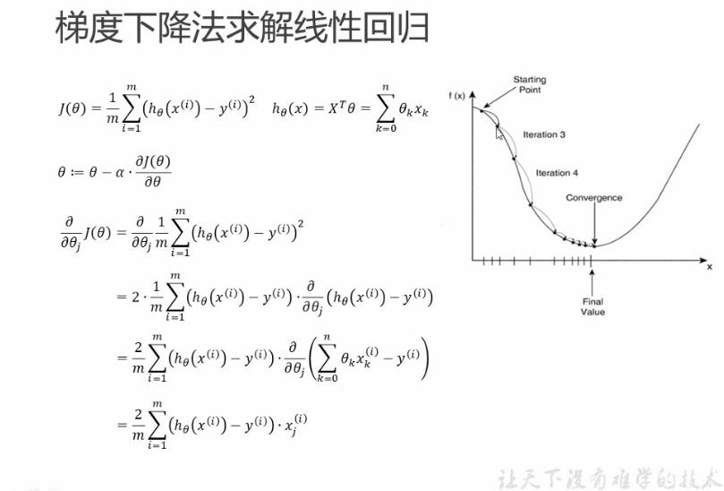

# 推荐系统

## 目的

- 信息过载
- 推荐系统
    - 推荐系统是信息过载所采用的措施，面对海量的数据信息，从中快速推荐出符合用户特点的物品。解决一些人的“选择恐惧症”；面向没有明确需求的人
    - 解决如何从大量信息中找到自己感兴趣的信息
    - 解决如何让自己生产的信息脱颖而出，受到大众的喜爱

## 思想

- 知你所想，精准推送
    - 利用用户和物品的特征信息，给用户推荐那些具有用户喜欢的特征的物品
- 物以类聚
    - 利用用户喜欢过的物品，给用户推荐相似的
- 人以群分
    - 利用和用户相似的其他用户，推荐那些和他们兴趣爱好相似的其他用户喜欢的物品

## 数据分析

## 分类
- 根据实时性
    - 离线推荐
    - 实时推荐
- 根据是否个性化
    - 基于统计推荐
    - 个性化推荐
- 根据推荐原则
    - 基于相似度
    - 基于知识
    - 基于模型
- 根据数据源
    - 基于人口统计学的推荐
    - 基于内容的推荐
    - 基于协同过滤

### 基于协同过滤的推荐算法

#### 协同过滤(CF)推荐方法
- 基于内容(CB) 主要利用的是用户评价过的物品的内容特征，而CF方法还可以利用其它用户评分过的物品内容

- CF可以解决CB的一些局限
    - 物品内容不完全或者难以获得时，依然可以通过其他用户的反馈进行推荐
    - CF基于用户之间对物品的评价质量，避免了CB仅依赖内容可能造成的对判断的干扰
    - CF不受内容限制，只要其他类似用户给出了对不同物品的兴趣，CF就可以给用户推荐出内容差异很大的物品（但有某种内在联系）
- 分为两类：基于近邻和基于模型

#### 混合推荐
- 加权
- 切换
- 分区
- 分层（多种机制，一个的输出作为另一个输入）

## 评测方法
- 离线实验
- 用户调查
- 在线实验

# 机器学习

## 什么是学习

- 人
    - 学习理论，在实战经验中总结
    - 在理论上推导，在实践中检验
    - 通过各种手段获取知识或技能的过程

- 机器
    - 处理某个特定任务，以大量的“经验”为基础
    - 对任务完成好坏给予一定评判标准
    - 通过分析经验数据，任务完成更好了

## 定义
ML主要研究计算机系统对于特定任务的性能，逐步进行改善的算法和统计模型
通过输入海量数据对模型进行训练，使得模型掌握数据所蕴含的潜在规律，进而对新输入的数据进行准确的分类或预测

## 分类

- 监督学习：提供数据并提供对应结果
- 无监督学习：提供数据不提供对应结果
- 强化学习：通过与环境交互并获取反馈延迟返回进而改进行为的学习过程

## 监督学习
- 包括分类和回归（相当于函数拟合）两类
- 如果输出被限制为有限的一组数值（离散数值）时使用分类算法；当输出可以具有范围内的任何数值（连续数值）时使用回归算法
- 相似度学习是回归和分类都密切相关的一类监督机器学习，它的目的是使用相似性函数从样本中学习，这个函数可以度量两个对象之间的相似度或关联度

### 三要素

- 模型：总结数据的内在规律，用数学函数描述的系统
- 策略：选取最优模型的评价准则
- 算法：选取最优模型的具体方法

e.g., 线性回归在这里指的是模型，不是算法

### 流程

### 模型评估策略
- 模型评估
    - 训练集和测试集
    - 损失函数和经验风险
    - 训练误差和测试误差
- 模型选择
    - 过拟合和欠拟合
    - 正则化和交叉验证

- 正则化可以避免过拟合
结构风险最小化(Structural Risk Minimization, SRM)是在ERM基础上为了防止过拟合提出来的策略。在经验风险上加了表示模型复杂度的正则化项，或者叫惩罚项。一般是模型复杂度的单调递增函数

- 遵循奥卡姆剃刀原则：若无必要，勿增实体

### 回归问题

- 也可以用梯度下降，牛顿法，拟牛顿法。梯度下降法只考虑一阶导数，牛顿法考虑二阶导数，所以收敛速度更快。牛顿法需要求解海塞矩阵逆矩阵，逆牛顿法通过正定矩阵近似海塞矩阵的逆矩阵

# 线性回归

a 称为学习率或补偿，不能太大也不能太小。（交叉验证）

## 梯度下降法与最小二乘法
- 相同点
    - 本质和目标相同：两种都是经典的机器学习算法，在给定已知数据的前提下利用求导算出一个模型（函数），使得损失函数最小，然后对给定的新数据进行估算预测
- 不同点
    - 损失函数：梯度下降可以选取其他损失函数，而最小二乘法一定是平方损失函数
    - 实现方法：最小二乘法直接求导找出全局最小，而梯度下降是一种迭代法
    - 效果：最小二乘法找到的一定是全剧最小，但计算繁琐，且复杂情况下未必有解。梯度下降法计算简单但一般是局部最小，只有目标函数是凸函数时才是全局最小；到最小点附近时收敛速度会变慢，且对初始点的选择极为敏感