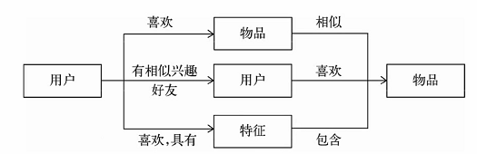
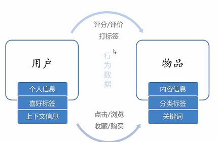
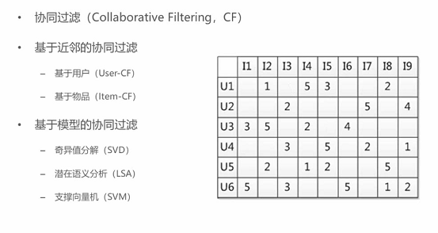

# 推荐系统

## 目的

- 信息过载
- 推荐系统
    - 推荐系统是信息过载所采用的措施，面对海量的数据信息，从中快速推荐出符合用户特点的物品。解决一些人的“选择恐惧症”；面向没有明确需求的人
    - 解决如何从大量信息中找到自己感兴趣的信息
    - 解决如何让自己生产的信息脱颖而出，受到大众的喜爱

## 思想

- 知你所想，精准推送
    - 利用用户和物品的特征信息，给用户推荐那些具有用户喜欢的特征的物品
- 物以类聚
    - 利用用户喜欢过的物品，给用户推荐相似的
- 人以群分
    - 利用和用户相似的其他用户，推荐那些和他们兴趣爱好相似的其他用户喜欢的物品

## 数据分析

## 分类
- 根据实时性
    - 离线推荐
    - 实时推荐
- 根据是否个性化
    - 基于统计推荐
    - 个性化推荐
- 根据推荐原则
    - 基于相似度
    - 基于知识
    - 基于模型
- 根据数据源
    - 基于人口统计学的推荐
    - 基于内容的推荐
    - 基于协同过滤

### 基于协同过滤的推荐算法

#### 协同过滤(CF)推荐方法
- 基于内容(CB) 主要利用的是用户评价过的物品的内容特征，而CF方法还可以利用其它用户评分过的物品内容

- CF可以解决CB的一些局限
    - 物品内容不完全或者难以获得时，依然可以通过其他用户的反馈进行推荐
    - CF基于用户之间对物品的评价质量，避免了CB仅依赖内容可能造成的对判断的干扰
    - CF不受内容限制，只要其他类似用户给出了对不同物品的兴趣，CF就可以给用户推荐出内容差异很大的物品（但有某种内在联系）
- 分为两类：基于近邻和基于模型

#### 混合推荐
- 加权
- 切换
- 分区
- 分层（多种机制，一个的输出作为另一个输入）